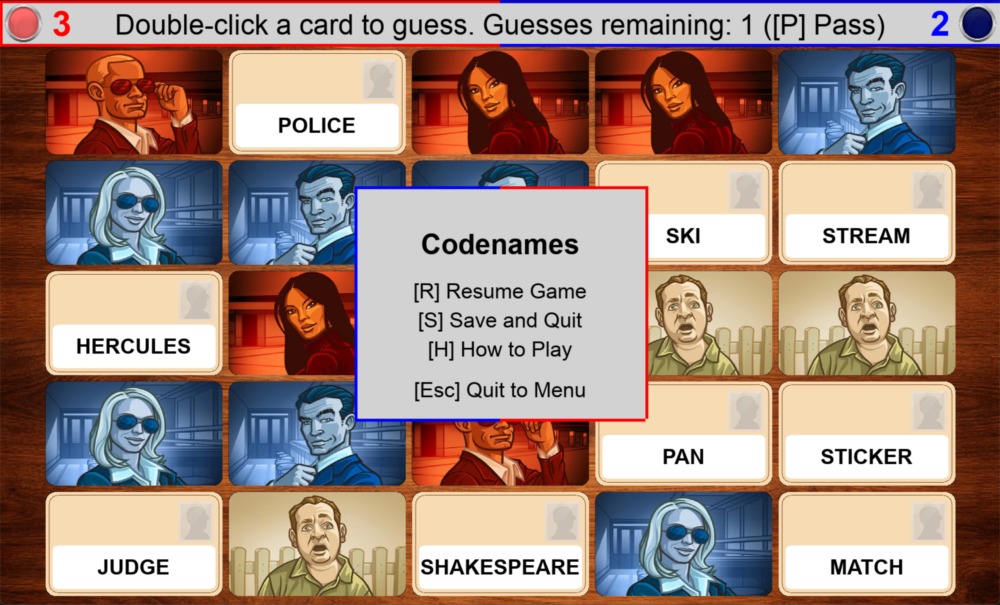

# Codenames

Codenames board game written in Python with [Pygame](https://www.pygame.org/wiki/about).

## Table of Contents

1. [Package Info and Use](#Package-Info-and-Use)
2. [Game Instructions](#Game-Instructions)
3. [Game Rules](#Game-Rules)
4. [Known Bugs](#Known-Bugs)

# Package Info and Use

There are two options for downloading and running the game:

## Option 1 (Run with python)
Download just [codenames.py](https://github.com/vaughntastic77/Codenames/tree/main/Codenames.py) and [images](https://github.com/vaughntastic77/Codenames/tree/main/images) into same directory and run.

## Option 2 (Single file .app/.exe):
Downlad ZIP of repository and open your OS folder:
### Mac (ARM)
Extract and run [Codenames.app](https://github.com/vaughntastic77/Codenames/tree/main/mac-arm64/dist/Codenames.app) from [mac-arm64/dist](https://github.com/vaughntastic77/Codenames/tree/main/mac-arm64/dist).
### Mac (Intel) (WIP)
Extract and run [Codenames.app](https://github.com/vaughntastic77/Codenames/tree/main/mac-x86_64/dist/Codenames.app) from [mac-x86_64/dist](https://github.com/vaughntastic77/Codenames/tree/main/mac-x86_64/dist).
### Windows (WIP)
Extract and run [Codenames.exe](https://github.com/vaughntastic77/Codenames/tree/main/win64/dist/Codenames.exe) from [win64/dist](https://github.com/vaughntastic77/Codenames/tree/main/win64/dist).

# Game Instructions (WIP)

The game opens to the main menu. Here you can choose to resume the last saved game or start a new game.

When you choose a new game, you can choose 1-4 players and then choose if you want computers to fill the rest.

Instructions are given in game, but the general flow is as follows:
1. Press `Space` to roll the die
2. Choose an available marble to move by pressing `1`, `2`, `3`, or `4`.
3. Choose a which space to move the chosen marble to by pressing `1`, `2`, or `3`, or press `Esc` to go back to choosing a marble.

At the start of any turn, the pause menu can be opened with `P`. Here you can choose to resume `R`, save and quit `S`, or quit to menu `Esc`.

When a player wins, you can return to the menu `Space` or continue playing `C`.

# Game Rules (WIP)
See the official rules at [here](https://filemanager.czechgames.com/storage/files/codenames/rules/codenames-rules-en.pdf).

## Objective:
WIP

## Play the game:
WIP

## Winning:
WIP

# Settings (WIP)

Time Limit: 

Number of assassins:

Styles: Classic | WIP: Family (Vaughns, Bertones, Malones), Avengers

# Known Bugs

1. Settings are not functional

2. Missing animations

<!-- All known fixable bugs are currently resolved. -->

Not fixable bugs:

1. There is currently a bug with pygame that sometimes causes the display to not update correctly.
